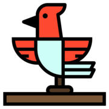

# Board Games in 3D!

This is a board game engine created in Three.JS and Rust, designed to make it as easy as possible to start playing a boardgame online.

[Try it now!](https://birdga.me/)

## Building

Building is simple. You will need a recent version of Rust + NPM.

First, install the npm packages with `npm install`. Next, run `build.sh`. You're done!

## Usage

All lobbies are given a unique URL: `https://example.com/lobby_name`. You can
give a lobby a custom name, or get a random one generated by visiting the base URL.

**Controls:**
- <kbd>Left click</kbd> and drag to orbit
- <kbd>Right click</kbd> or <kbd>Shift click</kbd> and drag to pan
- <kbd>Scroll wheel</kbd> to zoom
- <kbd>Click and drag</kbd> to pick up/put down objects
- <kbd>G</kbd> to add a card to your hand
- <kbd>T</kbd> to take an object or card from a bag or deck
- And of course <kbd>Right click</kbd> any object for more!

## Adding new games

Creating a new game is easy. Just zip up your assets with a `manifest.json` along with a script like `game.js`.
Then just drag your zip file onto the game window.

**Warning**: Since your game code runs in a web worker, that means that any state or logic can't be transfered.
If the host leaves, all other usefrs will be kicked out to prevent broken games.
If you don't want this to happen, call `self.world.close()` to indicate that your plugin is done.

There isn't any documentation yet, but take a look at `static/js/prelude.js` and `plugins/*/` for guidance.
